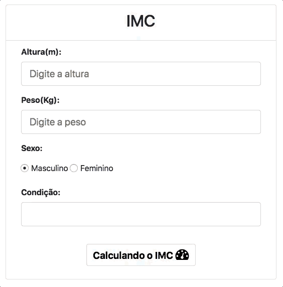

# Índice de Massa Corporal (IMC)

Avalie o peso de uma pessoa por meio do IMC utilizando as categorias por sexo da _Tabela 1_.

_Tabela 1 - Relação das categorias do IMC por sexo._

| Status                      | IMC Mulheres | IMC Homens  |
| --------------------------- | ------------ | ----------- |
| Abaixo do Peso              | < 19,1       | < 20,7      |
| Peso Normal                 | 19,1 - 25,8  | 20,7 - 26,4 |
| Marginalmente Acima do Peso | 25,8 - 27,3  | 26,4 - 27,8 |
| Acima do Peso Ideal         | 27,3 - 32,3  | 27,8 - 31,1 |
| Obeso                       | > 32,3       | > 31,1      |

Para calcular o IMC é necessário realizar a seguinte razão entre peso e altura:

```
BMI = weight/height²
```

Então, ao definir o peso e a altura como sendo respectivamente `200` e `1,5` o IMC será de `88,8888888889`, logo, o status será `Obeso` para ambos os sexos. Para analisar mais exemplos veja a _Tabela 2_.

_Tabela 2 - Conjunto de entradas e saídas para o cálculo do IMC._

| Entrada                                            | Saída            |
| -------------------------------------------------- | ---------------- |
| weight: `200`<br>height: `1,5`<br>sex: `masculino` | `Obeso`          |
| weight: `150`<br>height: `2`<br>sex: `feminino`    | `Obeso`          |
| weight: `100`<br>height: `2`<br>sex: `masculino`   | `Peso Normal`    |
| weight: `70`<br>height: `2`<br>sex: `feminino`     | `Abaixo do Peso` |

Em termos de interface este IMC pode ser calculado conforme a _Figura 1_.

_Figura 1 - Interface para calcular o IMC._


