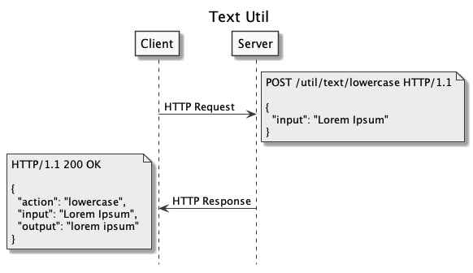
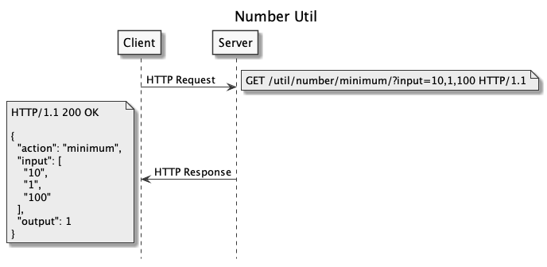

# API de Utilitários

Crie um utilitário de texto e número por meio de um servidor HTTP. A seguir será descrito a forma como deve ser criado as rotas para cada tipo de dado.

## Utilitário de Texto

---

Para realizar o processamento de texto primeiro deve-se considerar que as ações são definidas por estas opções:

| Ação        | Entrada       | Saída         |
| ----------- | ------------- | ------------- |
| `lowercase` | `Lorem Ipsum` | `lorem ipsum` |
| `uppercase` | `Lorem Ipsum` | `LOREM IPSUM` |

Ou seja, ao receber como entrada o texto `Lorem Ipsum` a ação `lowercase` vai gerar a saída `lorem ipsum`. A _Figura 1_ também ilustra como deve ser o processamento de texto que deve receber, em um pacote HTTP POST, a ação e a entrada respectivamente via rota e corpo do HTTP.

_Figura 1: Utilitário de Texto_

## Utilitário de Número

---

Para realizar o processamento de número primeiro deve-se considerar que as ações são definidas por estas opções:

| Ação      | Entrada      | Saída |
| --------- | ------------ | ----- |
| `minimum` | `10, 1, 100` | `1`   |
| `maximum` | `10, 1, 100` | `100` |

Ou seja, ao receber como entrada o texto `10, 1, 100` a ação `minimum` vai gerar a saída `1`. A _Figura 2_ também ilustra como deve ser o processamento de número que deve receber, em um pacote HTTP GET, a ação e a entrada respectivamente via rota e query do HTTP.

_Figura 2: Utilitário de Número_

